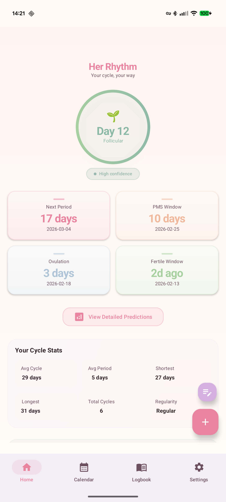
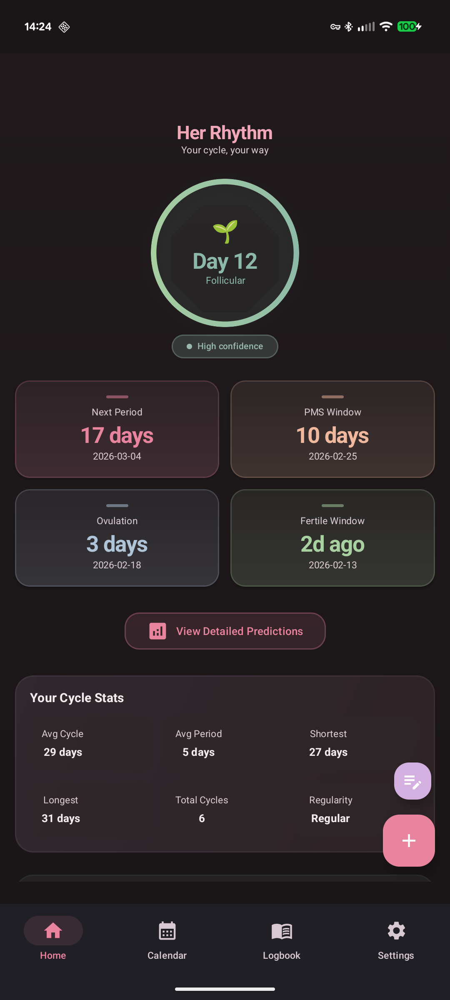
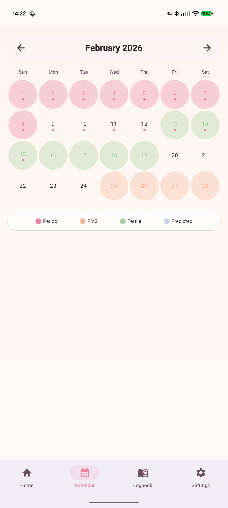
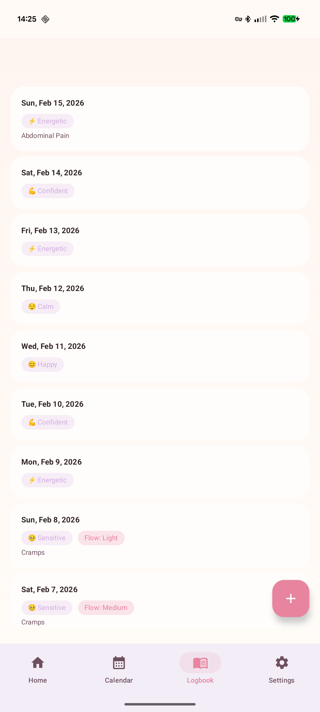
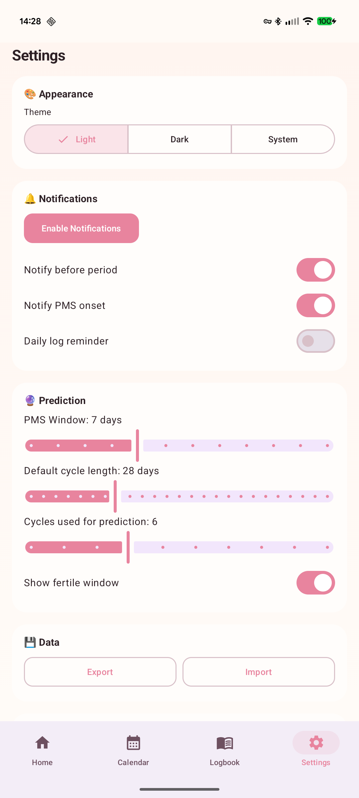

# Her Rhythm

A privacy-first menstrual cycle tracking app for Android. All data stays on-device — no internet permission, no accounts, no cloud sync.

## Features

- **Cycle Tracking** — Log period start/end dates, flow intensity, and cycle length
- **Predictions** — Forecasts next period, ovulation, fertile window, and PMS onset using weighted averaging with recency bias
- **Daily Logging** — Track mood, symptoms, lifestyle factors, and notes for any day
- **Calendar View** — Visual cycle phase overlay with color-coded days and log indicators
- **Logbook** — Searchable history of all daily logs
- **Notifications** — Optional reminders for upcoming period, PMS, and daily logging (via WorkManager)
- **Data Backup** — JSON export/import for manual backup
- **Theming** — Light, dark, and system-follow modes with warm gradient aesthetic

## Screenshots

<p align="center">
  
  
  
  
  
</p>

## Tech Stack

| Component | Technology |
|-----------|-----------|
| Language | Kotlin 2.1.0 |
| UI | Jetpack Compose (BOM 2024.12.01) + Material3 1.3.1 |
| Architecture | Clean Architecture (Domain/Data/Presentation) |
| DI | Hilt 2.53.1 |
| Database | Room 2.6.1 |
| Navigation | Compose Navigation 2.8.5 |
| Background | WorkManager 2.10.0 |
| Code Gen | KSP 2.1.0-1.0.29 |
| Min SDK | 26 (Android 8.0) |
| Target SDK | 35 (Android 15) |

## Building

```bash
# Debug build
./gradlew assembleDebug

# Install on connected device
./gradlew installDebug

# Run tests
./gradlew test
```

Requires JDK 17 and Android SDK 35.

## Privacy

Her Rhythm has **no internet permission** declared in the manifest. All cycle data, logs, and settings are stored locally in a Room database. No analytics, no telemetry, no data leaves the device.

## License

All rights reserved.
